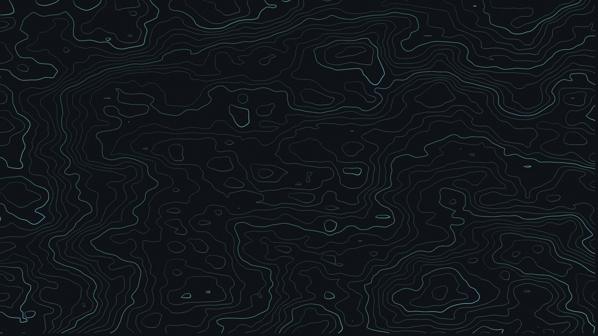
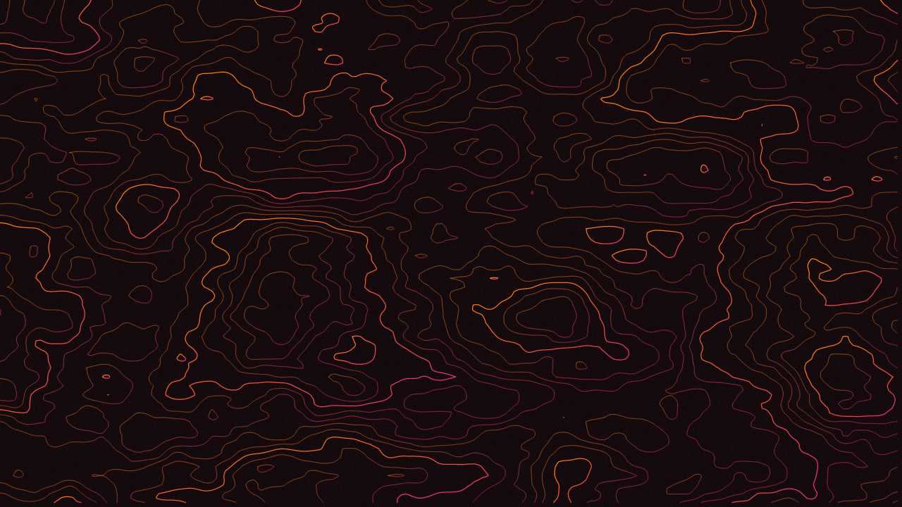
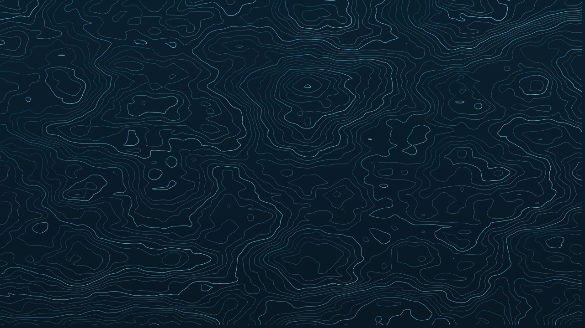
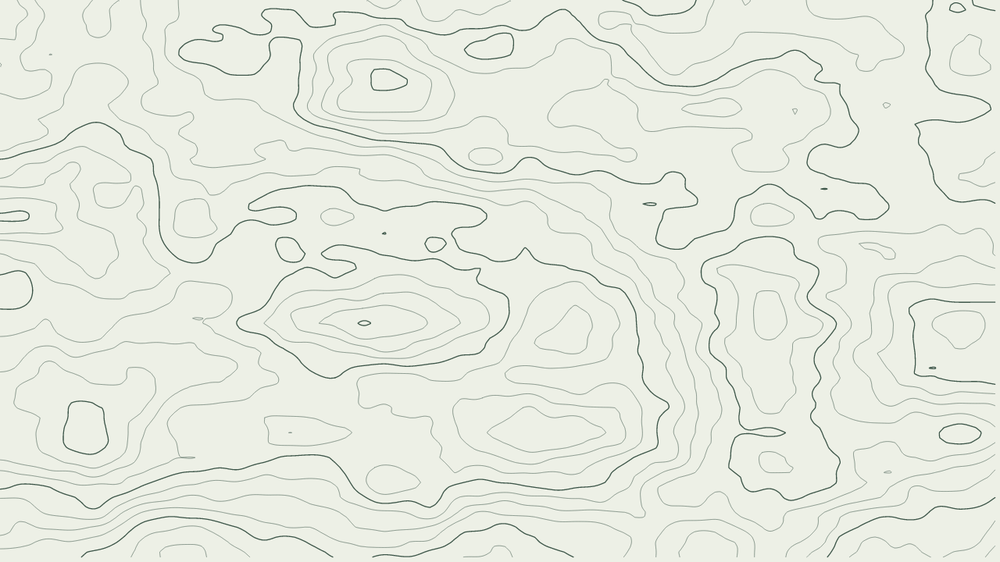
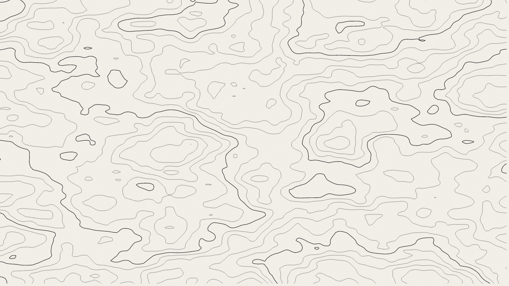
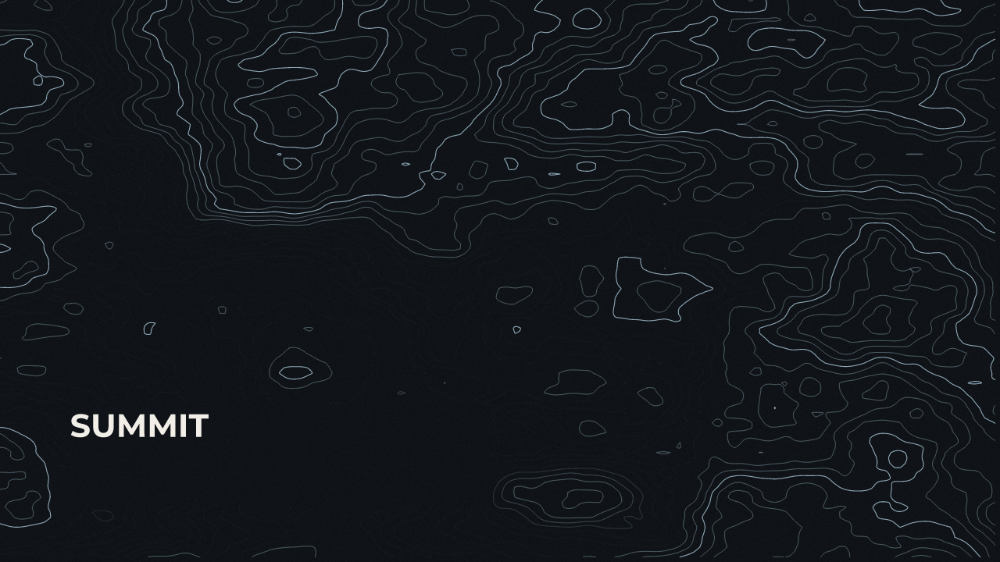
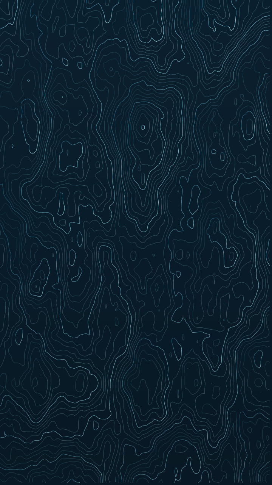

<p align="center"></p>

<h1 align="center">Hypso</h1>

<p align="center">Native desktop app that generates 4K topographic-style wallpapers:
fractal contour-map line art, fully procedural and reproducible by seed.</p>

<p align="center"><a href="https://skvggor.github.io/hypso/"><strong>Live site ↗</strong></a> — the generative core runs in your browser, compiled to WebAssembly.</p>

## Gallery

Every image below was generated by Hypso (`cargo run --example gallery`).

| | |
|---|---|
|  |  |
|  |  |
|  |  |

<p align="center"></p>

## Features

- Procedural contour patterns from seeded fractal noise. The same seed always
  recreates the same wallpaper.
- Desktop 16:9 (3840×2160) and mobile portrait formats (9:16 and 9:19.5).
- Background and line colors with a full picker: RGB sliders, live swatch, and
  hex or `r, g, b` text entry.
- Two-stop line gradient as an alternative to a single line color.
- Index contours: every Nth line rendered thicker, like a real map.
- Reserved text zones with feathered exclusion. The pattern flows around your
  Montserrat text instead of crossing it.
- Gradient overlay and soft film grain, each with its own intensity.
- Pixel-exact live preview through the same render pipeline as the export.
- TOML presets to save and reload full configurations.
- Keyboard navigation and screen-reader metadata across all controls.
- Single binary for Linux and Windows.

## Build and run

```sh
cargo run --release
```

Exports land in `~/Pictures/hypso-wallpapers` (or the platform equivalent).
Presets are stored as TOML in the platform config directory.

## Development

The generative core is a pure-function library built test-first
(red, green, refactor). The GUI is a thin Slint layer over it.

```sh
cargo test --lib               # library tests
cargo fmt --all --check        # formatting gate
cargo clippy --all-targets -- -D warnings   # lint gate
cargo llvm-cov --lib --fail-under-lines 80  # coverage gate
cargo run --example gallery    # regenerate docs/samples
cargo run --example logo       # regenerate the logo assets
```

### Landing page

The [live site](https://skvggor.github.io/hypso/) runs the same generative core
in the browser, compiled to WebAssembly. Source lives in `web/`; the build is
Rust end to end and deploys to GitHub Pages via `.github/workflows/deploy-site.yml`.

```sh
# 1. compile the core to wasm (pure generative subset, no GUI/raster)
wasm-pack build --target web --release --out-dir web/wasm --out-name hypso -- --no-default-features
# 2. generate the OG image, poster, and icons with Hypso's own engine
cargo run --example site --no-default-features --features render
# 3. minify web/ into dist/ (served by Pages)
cargo run --example build_site
```

Capability specs live in `openspec/specs/`. The original proposal, design and
task list are archived in `openspec/changes/archive/`.

## Stack

Rust, [Slint](https://slint.dev) (software renderer),
[resvg](https://github.com/linebender/resvg) / tiny-skia for rasterization,
embedded Montserrat.

## License

MIT, see [LICENSE](LICENSE). Bundled Montserrat font under the SIL Open Font
License (`assets/fonts/OFL.txt`).
